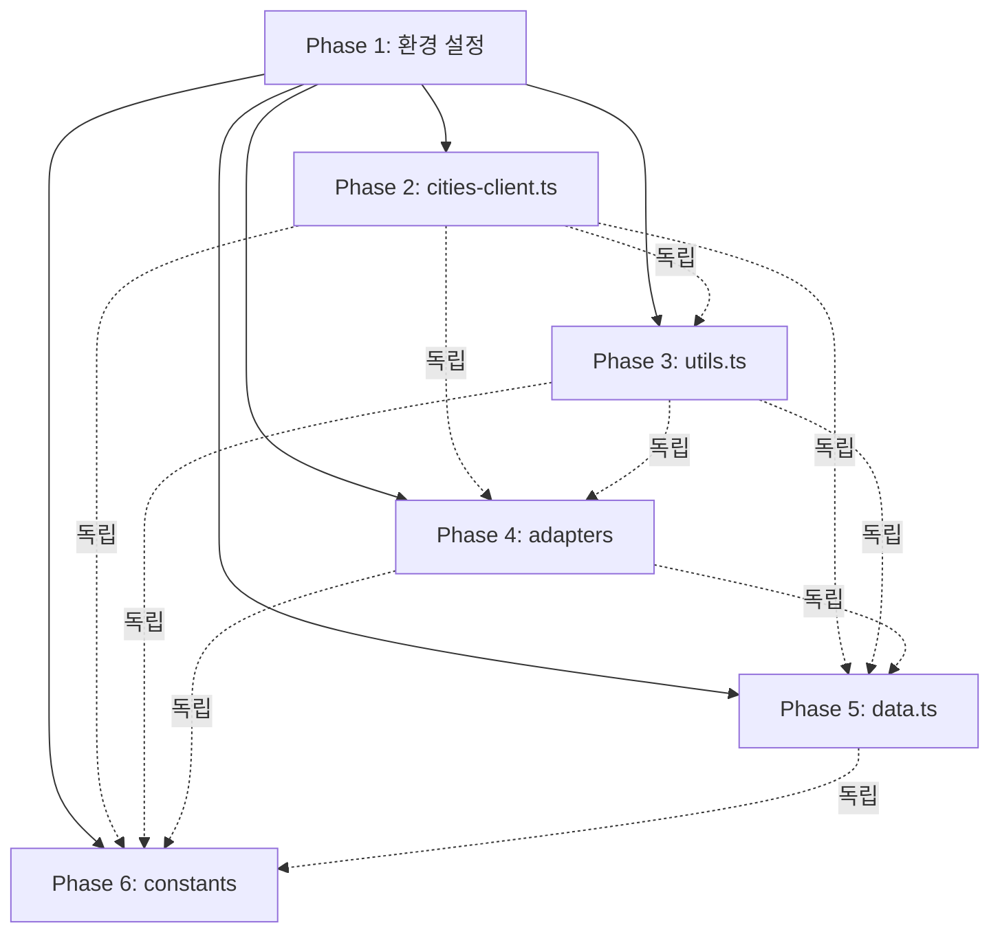

# 병렬 테스트 작성 실행 계획 (Parallel Test Implementation Plan)

## 📋 목차
1. [의존성 분석](#의존성-분석)
2. [병렬 실행 전략](#병렬-실행-전략)
3. [Subagent 할당 계획](#subagent-할당-계획)
4. [실행 순서 및 타임라인](#실행-순서-및-타임라인)
5. [에이전트 간 조율 전략](#에이전트-간-조율-전략)

---

## 의존성 분석

### Phase 1: 환경 설정 (순차 실행 필수)
**이유**: 모든 테스트가 동일한 설정에 의존

```
환경 설정 (Phase 1) - 단일 에이전트 필수
├── package.json에 테스트 라이브러리 추가
├── vitest.config.ts 생성
├── tsconfig.test.json 생성 (선택)
└── __tests__ 디렉토리 구조 생성
```

**의존성**: 없음 (최우선 실행)
**후속 작업**: Phase 2-6의 모든 테스트 작성
**예상 시간**: 45분

---

### Phase 2-6: 테스트 파일 작성 (병렬 실행 가능)

#### 의존성 그래프



**결론**: Phase 2-6은 **완전히 독립적**이므로 **5개 병렬 실행 가능**

---

## 병렬 실행 전략

### 전략 1: 최대 병렬화 (5 Subagents)
**장점**: 최고 속도 (이론적 45분 + 2시간 = 2시간 45분)
**단점**: 리소스 집약적, 충돌 가능성

```
Timeline:
├─ [0:00-0:45]  Agent 0: Phase 1 환경 설정 (단독)
└─ [0:45-2:45]  병렬 실행 (5 agents)
    ├─ Agent 1: Phase 2 (cities-client.ts - 24개, 2시간)
    ├─ Agent 2: Phase 3 (utils.ts - 18개, 1시간)
    ├─ Agent 3: Phase 4 (adapters - 15개, 45분)
    ├─ Agent 4: Phase 5 (data.ts - 20개, 1.5시간)
    └─ Agent 5: Phase 6 (constants - 8개, 20분)
```

**예상 총 시간**: 2시간 45분 (순차: 6.5시간 → 58% 단축)

---

### 전략 2: 우선순위 기반 (3 Subagents)
**장점**: 리소스 효율적, 안정적
**단점**: 중간 속도

```
Timeline:
├─ [0:00-0:45]  Agent 0: Phase 1 환경 설정
├─ [0:45-2:45]  Wave 1 (우선순위 HIGH/필수)
│   ├─ Agent 1: Phase 2 (cities-client - 2시간) 🔴 HIGH
│   ├─ Agent 2: Phase 3 (utils - 1시간) 🔴 필수
│   └─ Agent 3: Phase 4 (adapters - 45분) 🔴 필수
└─ [2:45-4:15]  Wave 2 (우선순위 중요/선택)
    ├─ Agent 2: Phase 5 (data.ts - 1.5시간) 🟡 중요
    └─ Agent 3: Phase 6 (constants - 20분) 🟢 선택
```

**예상 총 시간**: 4시간 15분 (순차: 6.5시간 → 35% 단축)

---

### 전략 3: 보수적 접근 (2 Subagents)
**장점**: 최소 충돌, 에러 추적 용이
**단점**: 느림

```
Timeline:
├─ [0:00-0:45]  Agent 0: Phase 1 환경 설정
├─ [0:45-2:45]  Wave 1
│   ├─ Agent 1: Phase 2 (cities-client - 2시간)
│   └─ Agent 2: Phase 3 (utils - 1시간)
├─ [2:45-4:30]  Wave 2
│   ├─ Agent 1: Phase 4 (adapters - 45분)
│   └─ Agent 2: Phase 5 (data.ts - 1.5시간)
└─ [4:30-4:50]  Wave 3
    └─ Agent 1 or 2: Phase 6 (constants - 20분)
```

**예상 총 시간**: 4시간 50분 (순차: 6.5시간 → 26% 단축)

---

## Subagent 할당 계획

### 🚀 추천: 전략 2 (3 Subagents)
**이유**: 효율성과 안정성의 균형

#### Agent 0: Setup Agent (환경 설정 전문)
**역할**: 테스트 환경 구축
**작업**: Phase 1
**예상 시간**: 45분

**작업 내용**:
```bash
1. pnpm add -D vitest @vitest/ui @testing-library/react @testing-library/jest-dom @testing-library/user-event msw
2. vitest.config.ts 생성
3. __tests__ 디렉토리 생성
   ├── unit/
   │   ├── api/
   │   ├── utils/
   │   ├── adapters/
   │   ├── data/
   │   └── constants/
   └── integration/ (미래 사용)
4. package.json에 test 스크립트 추가
5. 환경 설정 검증 (vitest --version)
```

---

#### Agent 1: High Priority Agent (핵심 비즈니스 로직)
**역할**: 최우선 필수 테스트 작성
**작업**: Phase 2 (cities-client.ts)
**예상 시간**: 2시간

**작업 내용**:
```typescript
파일: __tests__/unit/api/cities-client.test.ts

1. Supabase client mock 설정
2. localStorage mock 설정
3. MSW 서버 설정 (네트워크 에러 시뮬레이션)
4. toggleCityLike() 테스트 (20개)
   - 핵심 시나리오 (6개)
   - 에러 처리 (8개)
   - Edge cases (4개)
   - Fallback 로직 (2개)
5. fetchUserCityLikes() 테스트 (8개)
   - 정상 케이스 (3개)
   - 에러 처리 (3개)
   - Edge cases (2개)
```

**Mock 예시**:
```typescript
// Supabase mock
vi.mock('@/utils/supabase/client', () => ({
  createClient: vi.fn(() => ({
    auth: { getUser: vi.fn() },
    from: vi.fn(() => ({
      select: vi.fn().mockReturnThis(),
      insert: vi.fn().mockReturnThis(),
      update: vi.fn().mockReturnThis(),
      delete: vi.fn().mockReturnThis(),
      eq: vi.fn().mockReturnThis(),
      maybeSingle: vi.fn()
    }))
  }))
}));
```

---

#### Agent 2: Core Utilities Agent (핵심 유틸리티)
**역할**: 순수 함수 테스트 작성
**작업**: Phase 3 (utils.ts) → Phase 5 (data.ts)
**예상 시간**: 1시간 + 1.5시간 = 2.5시간

**Wave 1: Phase 3 - utils.ts (1시간)**
```typescript
파일: __tests__/unit/utils/utils.test.ts

1. cn() - 9개 테스트
   - 기본 병합, 조건부 클래스, 중복 제거
   - Tailwind 충돌, edge cases
2. formatCurrency() - 8개 테스트
   - 양수/음수, 큰 수, 작은 수
   - 소수점 반올림, 통화 기호
3. getCharacteristicEmoji() - 8개 테스트
   - 4가지 특성, unknown, edge cases
4. getCharacteristicLabel() - 7개 테스트
   - 4가지 라벨, unknown, edge cases
```

**Wave 2: Phase 5 - data.ts (1.5시간)**
```typescript
파일: __tests__/unit/data/data.test.ts

1. cities 배열 검증 (5개)
2. featuredCity 검증 (3개)
3. getCityById() (8개)
4. getRelatedCities() (17개)
   - 기본 동작, 점수 계산, 정렬, edge cases, 실제 데이터
```

---

#### Agent 3: Data Transform Agent (데이터 변환)
**역할**: 어댑터 및 상수 테스트 작성
**작업**: Phase 4 (adapters) → Phase 6 (constants)
**예상 시간**: 45분 + 20분 = 1시간 5분

**Wave 1: Phase 4 - adapters (45분)**
```typescript
파일: __tests__/unit/adapters/city-adapter.test.ts

1. adaptCityData() - 필드 변환 (10개)
   - snake_case → camelCase 변환
2. adaptCityData() - null/undefined 처리 (4개)
3. adaptCityData() - 배열 변환 (3개)
4. adaptCityData() - 전체 객체 (2개)
5. adaptCitiesData() - 배열 변환 (5개)
```

**Wave 2: Phase 6 - constants (20분)**
```typescript
파일: __tests__/unit/constants/filters.test.ts

1. BUDGET_OPTIONS (2개)
2. REGION_OPTIONS (2개)
3. ENVIRONMENT_OPTIONS (2개)
4. SEASON_OPTIONS (2개)
```

---

## 실행 순서 및 타임라인

### 타임라인 다이어그램

```
시간축 (분)
0        45       105      150      195      255
|--------|--------|--------|--------|--------|
Phase 1  │
(Setup)  │
─────────┘

         Phase 2 (Agent 1 - cities-client)
         ────────────────────────────────────→ (2시간)

         Phase 3 (Agent 2 - utils)
         ───────────────→ (1시간)
                        Phase 5 (Agent 2 - data)
                        ─────────────────────────→ (1.5시간)

         Phase 4 (Agent 3 - adapters)
         ──────────────→ (45분)
                       Phase 6 (Agent 3 - constants)
                       ────→ (20분)

총 소요 시간: 255분 (4시간 15분)
```

---

## 에이전트 간 조율 전략

### 1. 파일 충돌 방지
각 에이전트는 **완전히 다른 디렉토리**에 작업:
```
Agent 1 → __tests__/unit/api/
Agent 2 → __tests__/unit/utils/ + __tests__/unit/data/
Agent 3 → __tests__/unit/adapters/ + __tests__/unit/constants/
```
**충돌 가능성**: 0%

---

### 2. 공통 설정 파일 관리
**vitest.config.ts**: Agent 0이 생성 → Agent 1-3은 읽기 전용
**package.json**: Agent 0이 수정 → Agent 1-3은 읽기 전용

**전략**: Phase 1 완료 후에만 Phase 2-6 시작

---

### 3. Mock 파일 공유 (선택사항)
**옵션 A**: 각 에이전트가 독립적으로 mock 작성 (권장)
- 장점: 완전 독립, 충돌 없음
- 단점: 코드 중복

**옵션 B**: 공통 mock 파일 생성
- 파일: `__tests__/mocks/supabase.ts`
- Agent 1이 생성 → Agent 2-3이 import
- 단점: Agent 1이 먼저 완료되어야 함 (의존성 발생)

**권장**: 옵션 A (완전 독립)

---

### 4. 진행 상황 추적
각 에이전트는 완료 후 체크리스트 업데이트:

```markdown
## 테스트 작성 진행 상황

- [x] Phase 1: 환경 설정 (Agent 0) ✅
- [x] Phase 2: cities-client.ts (Agent 1) ✅
- [x] Phase 3: utils.ts (Agent 2) ✅
- [x] Phase 4: adapters (Agent 3) ✅
- [ ] Phase 5: data.ts (Agent 2) 🔄
- [ ] Phase 6: constants (Agent 3) ⏳
```

---

### 5. 에러 발생 시 대응
**시나리오**: Agent 2가 Phase 3에서 에러 발생

**대응 전략**:
1. Agent 2 작업 중단
2. Agent 0 (Setup Agent)이 에러 디버깅
3. Agent 2 재시작 또는 Agent 1이 Phase 3 인수
4. Agent 3는 계속 진행 (독립적)

**통신 방법**: 공유 로그 파일 또는 실시간 채팅

---

## 최종 실행 명령어

### Step 1: 환경 설정 (Agent 0)
```bash
# Task tool 사용
Task: "Setup test environment for Nomad Korea project"
Subagent: general-purpose
Prompt: "
Please set up the testing environment for this Next.js 15 project:
1. Install dependencies: vitest, @vitest/ui, @testing-library/react, @testing-library/jest-dom, @testing-library/user-event, msw
2. Create vitest.config.ts with Next.js path aliases
3. Create __tests__/unit/{api,utils,adapters,data,constants} directories
4. Add test scripts to package.json
5. Verify setup by running 'vitest --version'
"
```

### Step 2: 병렬 테스트 작성 (3 Agents)

#### Agent 1: High Priority
```bash
Task: "Write HIGH PRIORITY tests for cities-client.ts"
Subagent: general-purpose
Prompt: "
Write unit tests for lib/api/cities-client.ts (24 tests total):

File: __tests__/unit/api/cities-client.test.ts

1. Mock Supabase client
2. Mock localStorage
3. Setup MSW for network error simulation
4. Test toggleCityLike():
   - Core scenarios (6): null→like, like→null, like→dislike, null→dislike, dislike→null, dislike→like
   - Error handling (8): unauthenticated, DB errors, network timeout
   - Edge cases (4): race condition, invalid inputs
   - Fallback (2): localStorage fallback, sync
5. Test fetchUserCityLikes() (8 tests)

Follow the checklist in UNIT_TESTS_CHECKLIST.md Phase 2.
"
```

#### Agent 2: Core Utilities
```bash
Task: "Write tests for utils.ts and data.ts"
Subagent: general-purpose
Prompt: "
Write unit tests for lib/utils.ts (18 tests) and lib/data.ts (20 tests):

Phase 3 - File: __tests__/unit/utils/utils.test.ts
1. cn() - 9 tests
2. formatCurrency() - 8 tests
3. getCharacteristicEmoji() - 8 tests
4. getCharacteristicLabel() - 7 tests

Phase 5 - File: __tests__/unit/data/data.test.ts
1. cities array validation - 5 tests
2. featuredCity validation - 3 tests
3. getCityById() - 8 tests
4. getRelatedCities() - 17 tests (scoring algorithm, sorting, edge cases)

Follow UNIT_TESTS_CHECKLIST.md Phase 3 and Phase 5.
"
```

#### Agent 3: Data Transform
```bash
Task: "Write tests for city-adapter.ts and filters.ts"
Subagent: general-purpose
Prompt: "
Write unit tests for adapters and constants (23 tests total):

Phase 4 - File: __tests__/unit/adapters/city-adapter.test.ts
1. adaptCityData() - field conversion (10 tests)
2. adaptCityData() - null/undefined handling (4 tests)
3. adaptCityData() - array conversion (3 tests)
4. adaptCityData() - complete object (2 tests)
5. adaptCitiesData() - array conversion (5 tests)

Phase 6 - File: __tests__/unit/constants/filters.test.ts
1. BUDGET_OPTIONS - 2 tests
2. REGION_OPTIONS - 2 tests
3. ENVIRONMENT_OPTIONS - 2 tests
4. SEASON_OPTIONS - 2 tests

Follow UNIT_TESTS_CHECKLIST.md Phase 4 and Phase 6.
"
```

---

## 검증 체크리스트

### Phase 1 완료 확인
- [ ] vitest, @testing-library/react, msw 설치됨
- [ ] vitest.config.ts 생성됨
- [ ] `__tests__/unit/{api,utils,adapters,data,constants}` 디렉토리 존재
- [ ] package.json에 `test`, `test:ui`, `test:coverage` 스크립트 추가됨
- [ ] `pnpm test --version` 실행 가능

### Phase 2-6 완료 확인
- [ ] `__tests__/unit/api/cities-client.test.ts` 생성 (24 tests)
- [ ] `__tests__/unit/utils/utils.test.ts` 생성 (18 tests)
- [ ] `__tests__/unit/adapters/city-adapter.test.ts` 생성 (15 tests)
- [ ] `__tests__/unit/data/data.test.ts` 생성 (20 tests)
- [ ] `__tests__/unit/constants/filters.test.ts` 생성 (8 tests)
- [ ] 총 85개 테스트 작성 완료
- [ ] `pnpm test` 실행 → 모든 테스트 통과
- [ ] `pnpm test:coverage` → 80% 이상 커버리지

---

## 위험 요소 및 대응

### 위험 1: 의존성 충돌
**시나리오**: 여러 에이전트가 package.json 동시 수정
**확률**: 낮음 (Phase 1에서만 수정)
**대응**: Phase 1 완료 확인 후 Phase 2-6 시작

### 위험 2: Mock 설정 불일치
**시나리오**: 각 에이전트가 다른 방식으로 Supabase mock
**확률**: 중간
**대응**: Mock 코드 예시를 UNIT_TESTS_CHECKLIST.md에 명시

### 위험 3: TypeScript 경로 별칭 오류
**시나리오**: vitest가 `@/lib/*` 경로 인식 못함
**확률**: 중간
**대응**: vitest.config.ts에 resolve.alias 설정 포함

### 위험 4: 에이전트 간 통신 부재
**시나리오**: Agent 1 실패 시 Agent 2-3가 모름
**확률**: 높음
**대응**: 각 Phase 완료 후 검증 단계 추가

---

## 성공 기준

### 필수 조건 (Must Have)
- ✅ 85개 테스트 모두 작성 완료
- ✅ `pnpm test` 실행 시 모든 테스트 통과
- ✅ TypeScript 컴파일 에러 없음
- ✅ 80% 이상 코드 커버리지

### 권장 조건 (Should Have)
- ✅ 4시간 15분 이내 완료 (이론적 목표)
- ✅ Mock 코드 재사용 가능
- ✅ 테스트 코드 품질 (가독성, 유지보수성)

### 선택 조건 (Nice to Have)
- ✅ CI/CD 파이프라인 설정
- ✅ 테스트 문서화
- ✅ 90% 이상 커버리지

---

## 요약

### 병렬 실행 가능 여부
✅ **가능** - Phase 2-6은 완전히 독립적

### 추천 전략
🚀 **전략 2 (3 Subagents)** - 효율성과 안정성의 균형

### 예상 효과
- **순차 실행**: 6.5시간
- **병렬 실행**: 4시간 15분
- **단축률**: 35% (약 2시간 15분 절약)

### 에이전트 구성
1. **Agent 0**: Setup (환경 설정) - 45분
2. **Agent 1**: High Priority (cities-client.ts) - 2시간
3. **Agent 2**: Core Utilities (utils.ts + data.ts) - 2.5시간
4. **Agent 3**: Data Transform (adapters + constants) - 1시간 5분

### 실행 순서
```
Phase 1 (순차) → Phase 2-6 (병렬 Wave 1) → Phase 5-6 (병렬 Wave 2)
```

---

**작성일**: 2025-01-21
**작성자**: Claude Code
**프로젝트**: Nomad Korea
**버전**: 1.0
